# Universidade Grupo Treze

Repositório destinado ao trabalho do Projeto Integrador do III semestre do Senac. O grupo contém 6 integrantes:

- Antônio Gabriel Sousa Lira
- João Vitor de Carvalho Alves
- Nathan da Silva Rocha
- Pedro Ivo Maldonado Roschel
- Vinicius Cardoso Meira

## Descrição/Objetivo

O presente projeto propõe o desenvolvimento de um sistema de gestão escolar para centros universitários, através de uma plataforma integrada e intuitiva para o gerenciamento eficiente de informações acadêmicas e administrativas.

## Diagrama de caso de uso

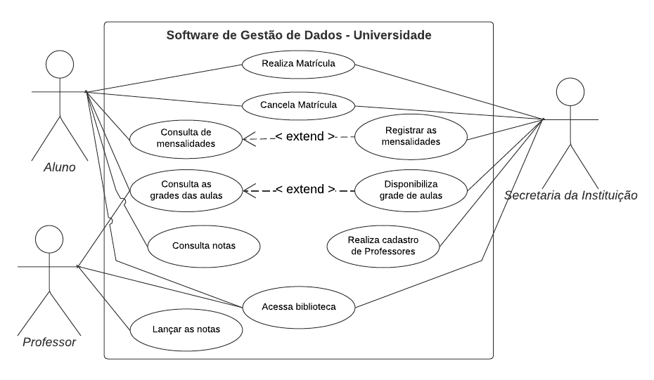

## Diagrama de classe - UML

## Telas

### Funcionalidade: Cadastro de alunos/ Realizar Matrícula

Tela de realização do login do usuário. Nesta caso para realização da matrícula, o usuário deve clicar na opção "Realizar Matrícula".

Visão Mobile:

Visão Desktop/Grande telas:

#### Preenchimento Matrícula

O usuário será redirecionado a página de preenchimento para uma "pré-matrícula", constando na parte superior uma mensagem de aviso. O usuário deverá selecionar o curso, preencher os demais campos e finalizar realizando os uploads dos documentos necessários.

Visão Mobile:

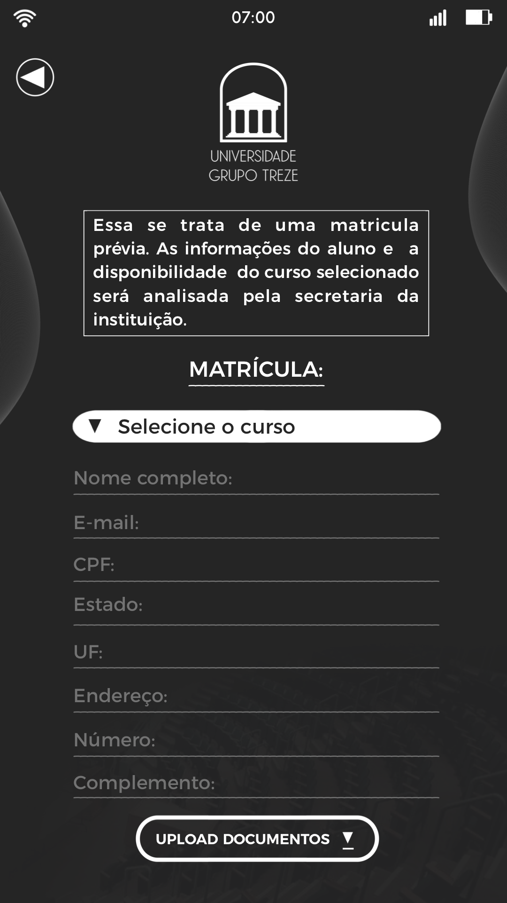

Visão Desktop/Grande telas:

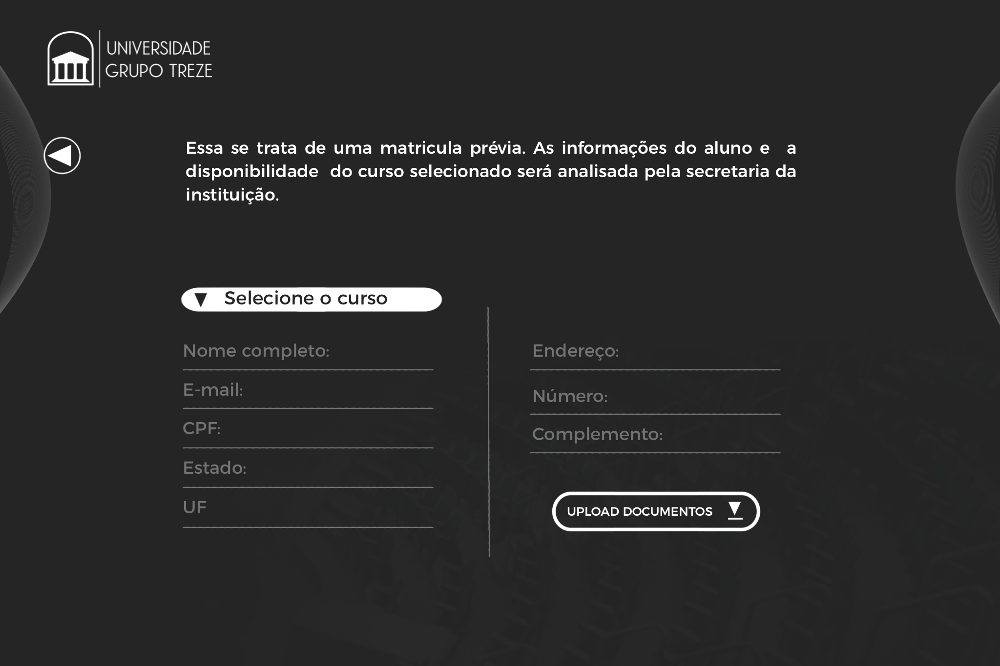

#### Mensagem conclusão

Após upload doas arquivos o usuário será redirecionado para uma página com um aviso de conclusão.

Visão Mobile:

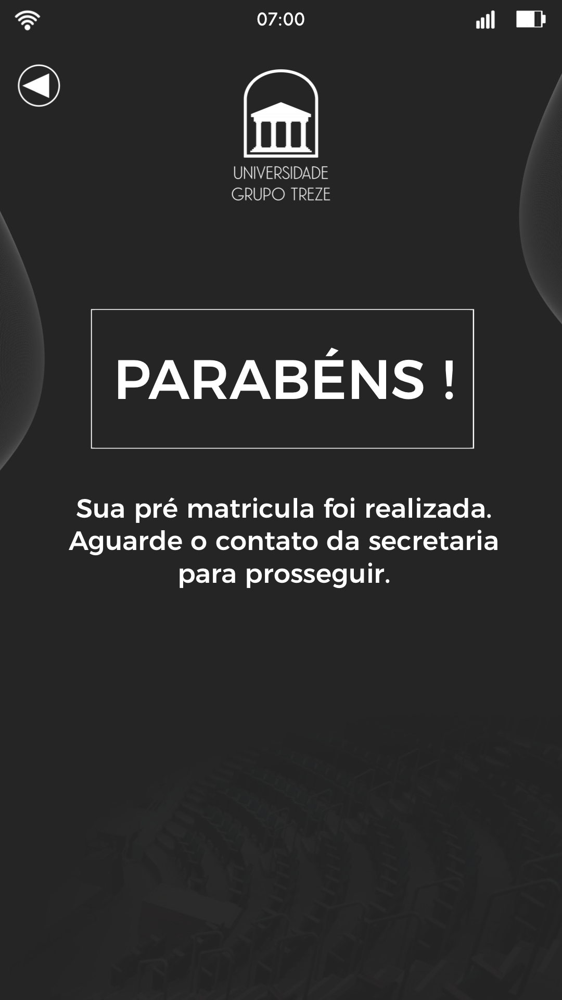

Visão Desktop/Grande telas:

### Funcionalidade: Cadastro de Professores

Tela de realização do login do usuário. Para realizar o cadastro de professores, o login deve ser feito por um usuário da Secretaria que possui acesso a essa função.

Visão Mobile:

Visão Desktop/Grande telas:

#### Área da Secretaria

Ao acessar com o login e senha, o usuário terá acesso as funcionalidades de acordo com seu tipo de perfil.Nesse caso foi clicado na opção "Cadastrar Usuário Proferssor.

Visão Mobile:

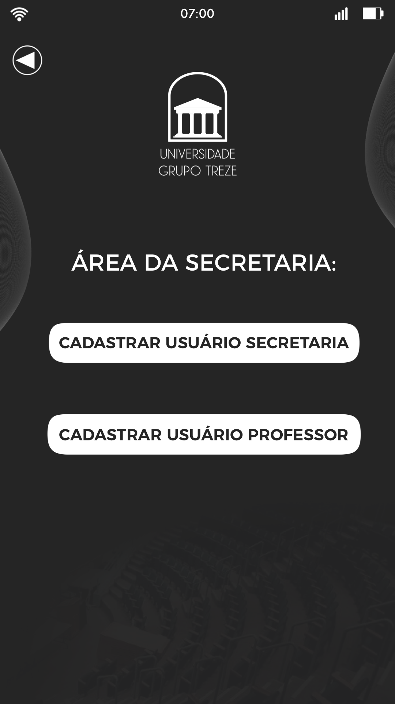

Visão Desktop/Grande telas:

#### Cadastro de Professor

Na próxima tela deverá ser preenchidos os campos com a informação do profissional. É necessário selecionar a área de ensino (podendo ser mais de uma) e realizar o upload dos documentos necessários.

Visão Mobile:

Visão Desktop/Grande telas:

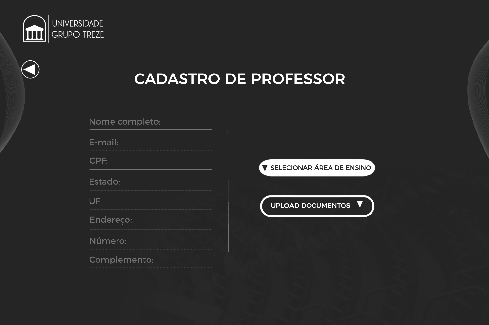

#### Mensagem conclusão

A próxima tela orá exibir uma mensagem de conclusão e o ID do usuário.

Visão Mobile:

Visão Desktop/Grande telas:

### Funcionalidade: Cadastro do usuário da Secretária da Universidade

Tela de realização do login do usuário. Para realizar o cadastro de usuários da secretaria o login deve ser feito por um usuário da Secretaria que possui acesso a essa função.

Visão Mobile:

Visão Desktop/Grande telas:

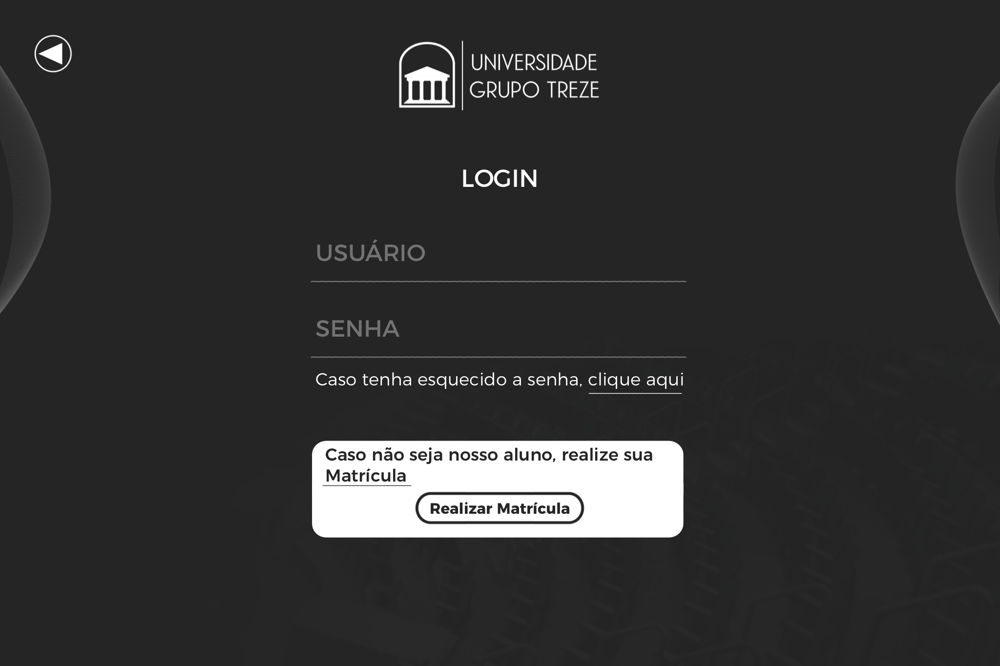

#### Área da Secretaria

Ao acessar com o login e senha, o usuário terá acesso as funcionalidades de acordo com seu tipo de perfil. Nesse caso foi clicado na opção "Cadastrar Usuário Secretaria".

Visão Mobile: 

Visão Desktop/Grande telas: 

#### Cadastro Usuário da Secretaria

Na próxima tela deverá ser preenchidos os campos com a informação do usuário e realizar o upload dos documentos necessários.

Visão Mobile:

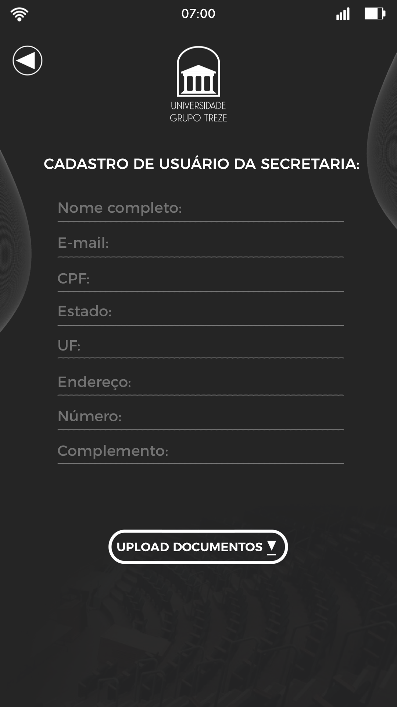

Visão Desktop/Grande telas:

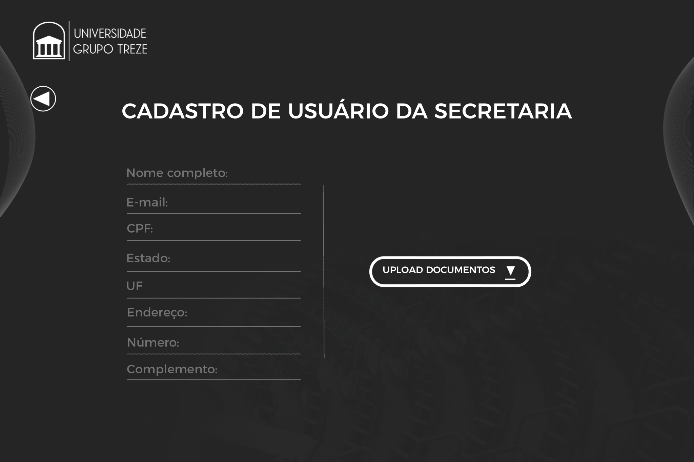

#### Mensagem de conclusão

A próxima tela irá exibir uma mensagem de conclusão e o ID do usuário.

Visão Mobile:

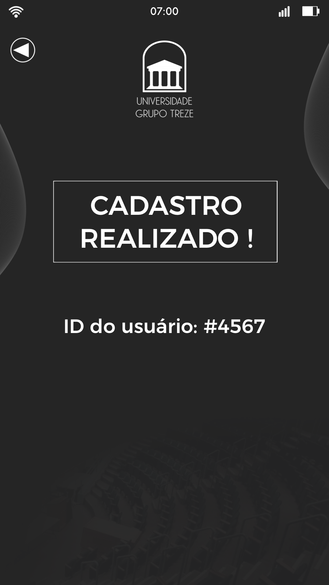

Visão Desktop/Grande telas

### Funcionalidade: Cancelar Matrícula

Tela de realização do login do usuário. Para solicitar o cancelamento da matrícula, o login deve ser feito por um aluno.

Visão Mobile:

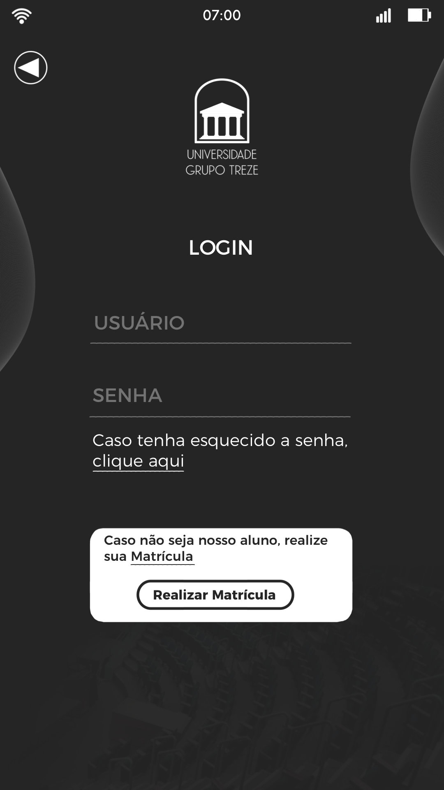

Visão Desktop/Grande telas:

#### Área do aluno

Ao acessar com o login e senha, o usuário terá acesso as funcionalidades de acordo com seu tipo de perfil. Nesse caso foi clicado na opção "Solicitar Cancelamento Matrícula".

Visão Mobile:

Visão Desktop/Grande telas:

#### Cancelamento de Matrícula

Na próxima tela o aluno deverá descrever o motivo do cancelamento e clicar na opção "Enviar Solicitação".

Visão Mobile:

Visão Desktop/Grande telas: 

#### Mensagem Cancelamento de Matrícula

A próxima tela irá exibir uma mensagem confirmando o envio da solicitação.

Visão Mobile:

Visão Desktop/Grande telas:

### Funcionalidade: Consultar Mensalidade.

Tela de realização do login do usuário. Para consultar a mensalidade, o login deve ser feito por im aluno.

Visão Mobile:

Visão Desktop/Grande telas:

#### Área do Aluno

Ao acessar com o login e senha, o usuário terá acesso as funcionalidades de acordo com seu tipo de perfil. Nesse caso foi clicado na opção "Consultar Mensalidade".

Visão Mobile:

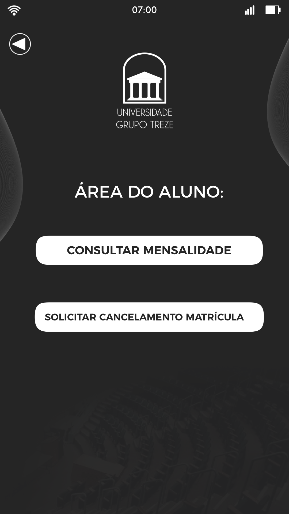

Visão Desktop/Grande telas:

#### Consulta Mensalidades

Na próxima tela será apresentada duas seções separadas em boletos abertos e pagos, o aluno terá opção de baixar o modelo em aberto.

Visão Mobile:

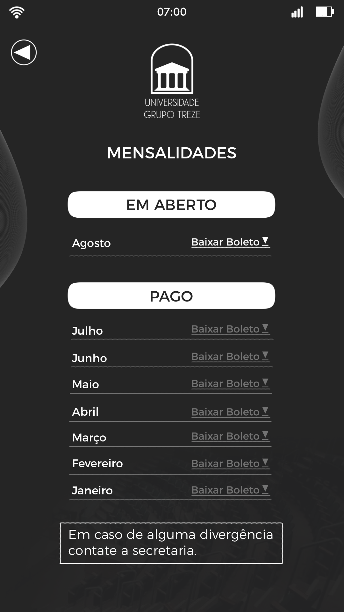

Visão Desktop/Grande Telas:

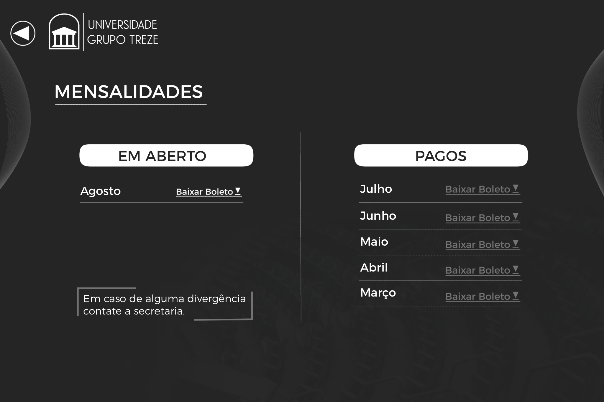

### Funcionalidade: Atribuir Notas.

Tela de realização do login do usuário. Para atribuir notas, o login deve ser feito por um professor.

Visão Mobile:

Visão Desktop/Grande Telas:

#### Área do Professor

Ao acessar com o login e senha, o usuário terá acesso as funcionalidaeds de acordo com seu tipo de perfil. Nesse casi foi clicado na opção "Atribuir Notas".

Visão Mobile:

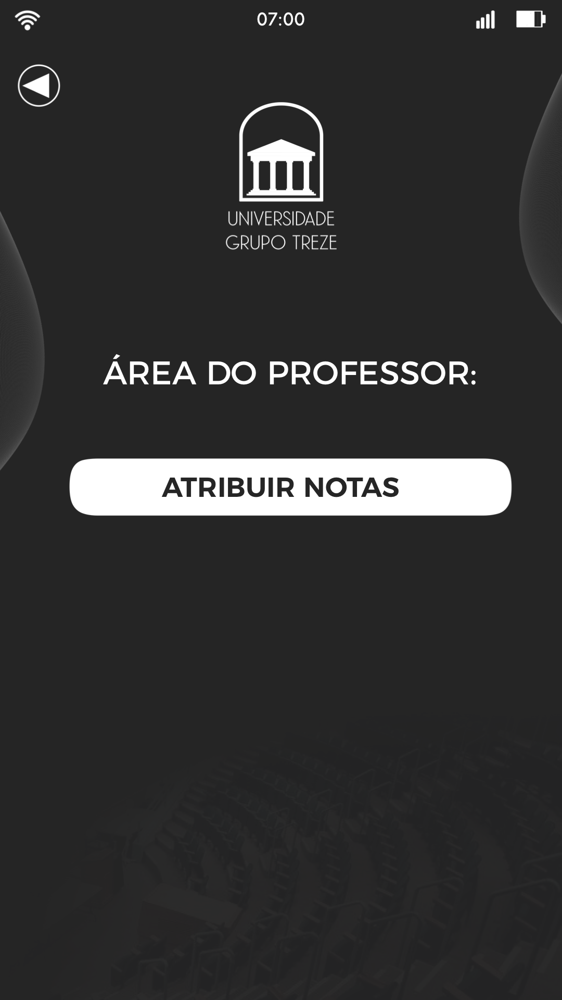

Visão Desktop/Grande telas:

#### Atribuir Notas

Ao acessar a opção, o professor irá selecionar a matéria e a turma, ambas informações serão apresentadas na tela e com base no escolhido será apresentado uma listagem dos alunos da turma. Cada linha corresponde a um aluno e para cada um a três colunas para preenchimento das notas, de acordo com o critério adotado pela universidade.

Visão Mobile:

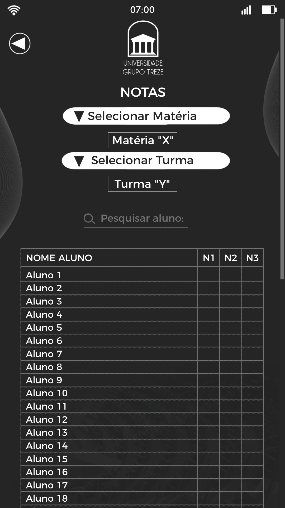

Visão Desktop/Grande telas:

# Universidade Grupo Treze

Repositório destinado ao trabalho do Projeto Integrador do III semestre do Senac. O grupo contém 6 integrantes:

- Antônio Gabriel Sousa Lira
- João Vitor de Carvalho Alves
- Nathan da Silva Rocha
- Pedro Ivo Maldonado Roschel
- Vinicius Cardoso Meira

## Descrição/Objetivo

O presente projeto propõe o desenvolvimento de um sistema de gestão escolar para centros universitários, através de uma plataforma integrada e intuitiva para o gerenciamento eficiente de informações acadêmicas e administrativas.

## Diagrama de caso de uso

## Diagrama de classe - UML

## Telas

### Funcionalidade: Cadastro de alunos/ Realizar Matrícula

Tela de realização do login do usuário. Nesta caso para realização da matrícula, o usuário deve clicar na opção "Realizar Matrícula".

Visão Mobile:

Visão Desktop/Grande telas:

#### Preenchimento Matrícula

O usuário será redirecionado a página de preenchimento para uma "pré-matrícula", constando na parte superior uma mensagem de aviso. O usuário deverá selecionar o curso, preencher os demais campos e finalizar realizando os uploads dos documentos necessários.

Visão Mobile:

Visão Desktop/Grande telas:

#### Mensagem conclusão

Após upload doas arquivos o usuário será redirecionado para uma página com um aviso de conclusão.

Visão Mobile:

Visão Desktop/Grande telas:

### Funcionalidade: Cadastro de Professores

Tela de realização do login do usuário. Para realizar o cadastro de professores, o login deve ser feito por um usuário da Secretaria que possui acesso a essa função.

Visão Mobile:

Visão Desktop/Grande telas:

#### Área da Secretaria

Ao acessar com o login e senha, o usuário terá acesso as funcionalidades de acordo com seu tipo de perfil.Nesse caso foi clicado na opção "Cadastrar Usuário Proferssor.

Visão Mobile:

Visão Desktop/Grande telas:

#### Cadastro de Professor

Na próxima tela deverá ser preenchidos os campos com a informação do profissional. É necessário selecionar a área de ensino (podendo ser mais de uma) e realizar o upload dos documentos necessários.

Visão Mobile:

Visão Desktop/Grande telas:

#### Mensagem conclusão

A próxima tela orá exibir uma mensagem de conclusão e o ID do usuário.

Visão Mobile:

Visão Desktop/Grande telas:

### Funcionalidade: Cadastro do usuário da Secretária da Universidade

Tela de realização do login do usuário. Para realizar o cadastro de usuários da secretaria o login deve ser feito por um usuário da Secretaria que possui acesso a essa função.

Visão Mobile:

Visão Desktop/Grande telas:

#### Área da Secretaria

Ao acessar com o login e senha, o usuário terá acesso as funcionalidades de acordo com seu tipo de perfil. Nesse caso foi clicado na opção "Cadastrar Usuário Secretaria".

Visão Mobile: 

Visão Desktop/Grande telas: 

#### Cadastro Usuário da Secretaria

Na próxima tela deverá ser preenchidos os campos com a informação do usuário e realizar o upload dos documentos necessários.

Visão Mobile:

Visão Desktop/Grande telas:

#### Mensagem de conclusão

A próxima tela irá exibir uma mensagem de conclusão e o ID do usuário.

Visão Mobile:

Visão Desktop/Grande telas

### Funcionalidade: Cancelar Matrícula

Tela de realização do login do usuário. Para solicitar o cancelamento da matrícula, o login deve ser feito por um aluno.

Visão Mobile:

Visão Desktop/Grande telas:

#### Área do aluno

Ao acessar com o login e senha, o usuário terá acesso as funcionalidades de acordo com seu tipo de perfil. Nesse caso foi clicado na opção "Solicitar Cancelamento Matrícula".

Visão Mobile:

Visão Desktop/Grande telas:

#### Cancelamento de Matrícula

Na próxima tela o aluno deverá descrever o motivo do cancelamento e clicar na opção "Enviar Solicitação".

Visão Mobile:

Visão Desktop/Grande telas: 

#### Mensagem Cancelamento de Matrícula

A próxima tela irá exibir uma mensagem confirmando o envio da solicitação.

Visão Mobile:

Visão Desktop/Grande telas:

### Funcionalidade: Consultar Mensalidade.

Tela de realização do login do usuário. Para consultar a mensalidade, o login deve ser feito por im aluno.

Visão Mobile:

Visão Desktop/Grande telas:

#### Área do Aluno

Ao acessar com o login e senha, o usuário terá acesso as funcionalidades de acordo com seu tipo de perfil. Nesse caso foi clicado na opção "Consultar Mensalidade".

Visão Mobile:

Visão Desktop/Grande telas:

#### Consulta Mensalidades

Na próxima tela será apresentada duas seções separadas em boletos abertos e pagos, o aluno terá opção de baixar o modelo em aberto.

Visão Mobile:

Visão Desktop/Grande Telas:

### Funcionalidade: Atribuir Notas.

Tela de realização do login do usuário. Para atribuir notas, o login deve ser feito por um professor.

Visão Mobile:

Visão Desktop/Grande Telas:

#### Área do Professor

Ao acessar com o login e senha, o usuário terá acesso as funcionalidaeds de acordo com seu tipo de perfil. Nesse casi foi clicado na opção "Atribuir Notas".

Visão Mobile:

Visão Desktop/Grande telas:

#### Atribuir Notas

Ao acessar a opção, o professor irá selecionar a matéria e a turma, ambas informações serão apresentadas na tela e com base no escolhido será apresentado uma listagem dos alunos da turma. Cada linha corresponde a um aluno e para cada um a três colunas para preenchimento das notas, de acordo com o critério adotado pela universidade.

Visão Mobile:

Visão Desktop/Grande telas:

